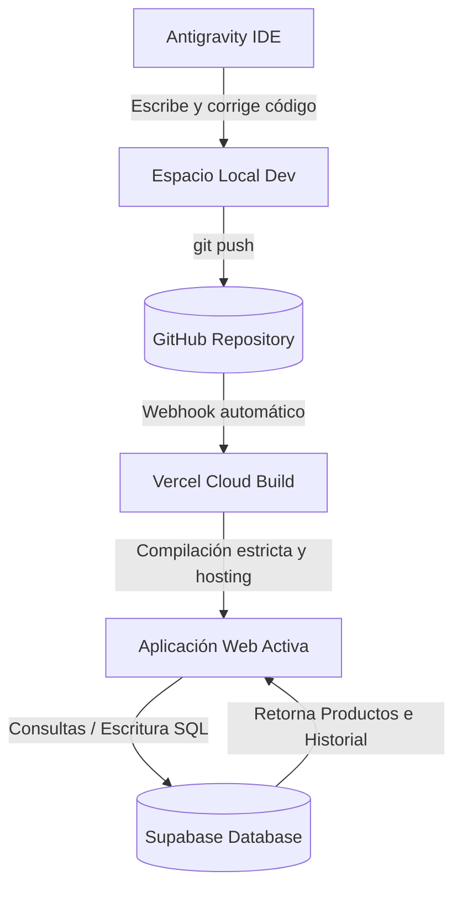
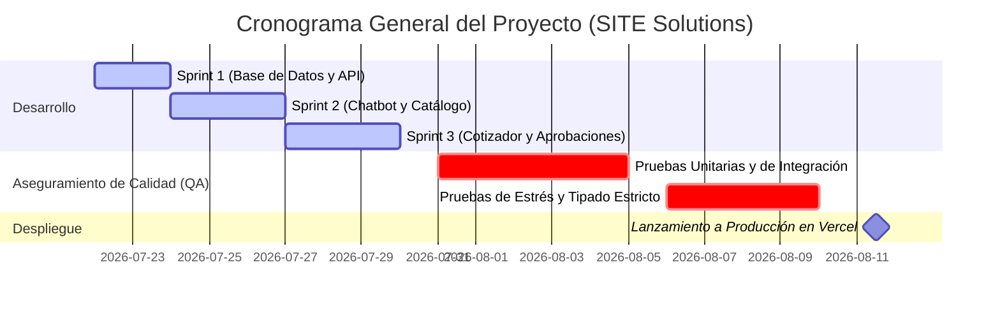

# 📄 Documentación del Proyecto: Catálogo Inteligente y Asistente de Cotizaciones
**Cliente:** SITE Computer Solutions  
**Metodología:** Scrum  
**Cronograma:** Desarrollo (1 semana/Sprint diario equivalente) | Testing (31 Jul - 10 Ago) | Despliegue Final (11 Ago)

---

## 🌐 1. Arquitectura y Ecosistema de Sistemas (Overview)

El proyecto está diseñado bajo una arquitectura web moderna y desacoplada (Jamstack), apoyada por herramientas de desarrollo ágil e integración continua. A continuación se detallan los sistemas clave utilizados, su propósito y cómo interactúan entre sí:

| Sistema | ¿Para qué sirve? | Rol en este Proyecto | ¿Cómo se conecta? |
| :--- | :--- | :--- | :--- |
| **Next.js** | Framework web React de producción. | Soporte de la interfaz del catálogo, paneles de usuario y procesamiento local del chatbot. | Ejecuta la lógica del cliente y realiza peticiones asíncronas hacia Supabase. |
| **Supabase** | Backend como Servicio (BaaS) basado en PostgreSQL. | Base de datos principal para persistir productos, registros de auditoría y almacenamiento de PDF técnicos. | Se conecta a Next.js por HTTPS usando el cliente oficial de JS SDK con credenciales de API. |
| **GitHub** | Plataforma de alojamiento de código y control de versiones. | Repositorio centralizado para almacenar y asegurar el código fuente (`SITE-Computer-Solutions-main`). | Se conecta localmente mediante Git por SSH/HTTPS y con Vercel por Webhooks automáticos. |
| **Vercel** | Plataforma de nube para despliegue y hospedaje web. | Hospeda la aplicación web, compila el código en producción y expone el sitio bajo HTTPS seguro. | Se activa automáticamente ante cada `git push` a la rama `main` en GitHub, realizando el build. |
| **Antigravity** | Asistente de Inteligencia Artificial (IA) de desarrollo. | Co-programador para diseñar la lógica, corregir la compatibilidad, resolver errores de tipos y documentar. | Integrado directamente en el entorno de desarrollo como agente autónomo de codificación. |

### 🔄 Diagrama de Conectividad y Flujo de Trabajo

El flujo de información y desarrollo sigue un camino lineal e integrado para asegurar la calidad y la automatización:



---

## 📋 2. Marco de Trabajo Scrum (Historias de Usuario)

El proyecto se estructuró en **Sprints de Desarrollo Diario** para lograr un Producto Mínimo Viable (MVP) completamente funcional en una semana, seguido de fases estrictas de Aseguramiento de Calidad (QA) y Despliegue.

### 🗺️ Backlog del Producto (Product Backlog)



---

### 👤 Historias de Usuario por Sprint

#### **Sprint 1: Cimientos y Conexión de Datos**
*   **Historia de Usuario 1.1: Conexión con Supabase**
    *   **Como** Administrador del Sistema,
    *   **Quiero** configurar e integrar una base de datos relacional en la nube (Supabase) con la aplicación Next.js,
    *   **Para** que la información de productos, historial de auditoría y catálogos persista de forma segura y centralizada.
    *   *Criterios de Aceptación:*
        *   Conexión exitosa usando variables de entorno (`NEXT_PUBLIC_SUPABASE_URL` y `NEXT_PUBLIC_SUPABASE_ANON_KEY`).
        *   Manejo de un modo de respaldo (Local Fallback) si las credenciales no están presentes.
*   **Historia de Usuario 1.2: Modelo e Ingesta de Productos**
    *   **Como** Gestor de Inventario,
    *   **Quiero** contar con una tabla estructurada de productos en la base de datos con SKU, marca, precio, stock, descripción, especificaciones técnicas y almacén de origen,
    *   **Para** asegurar que la información técnica y comercial de los equipos esté normalizada.
    *   *Criterios de Aceptación:*
        *   Tabla `products` creada con tipos de datos correctos en Supabase.
        *   Script de semilla para poblar los productos base (laptops, desktops, fuentes, tarjetas madre, switches y NAS).

#### **Sprint 2: Catálogo y Primer Contacto del Asistente**
*   **Historia de Usuario 2.1: Panel Visual de Productos**
    *   **Como** Vendedor o Consultor Técnico,
    *   **Quiero** visualizar los productos en una cuadrícula moderna con filtros de búsqueda rápida por SKU/nombre y categorías,
    *   **Para** localizar componentes rápidamente durante una consulta telefónica o presencial.
    *   *Criterios de Aceptación:*
        *   Búsqueda interactiva en tiempo real sin recarga de página.
        *   Indicadores visuales de stock bajo (menor a 5 unidades) y asignación automática de almacén.
*   **Historia de Usuario 2.2: Chatbot de Consulta Simple**
    *   **Como** Vendedor o Cliente Interno,
    *   **Quiero** chatear con un asistente inteligente que entienda consultas de stock, especificaciones y precios de productos a través de lenguaje natural y SKUs,
    *   **Para** obtener respuestas instantáneas sin navegar manualmente en el inventario.
    *   *Criterios de Aceptación:*
        *   El bot debe analizar palabras clave como "precio", "cuánto cuesta", "stock", "tienen", "especificaciones".
        *   Retorno inmediato del precio formateado en pesos mexicanos (MXN) y ubicación física del stock.

#### **Sprint 3: Módulo Cotizador y Gestión de Aprobaciones**
*   **Historia de Usuario 3.1: Cotizador Multi-producto Avanzado**
    *   **Como** Vendedor,
    *   **Quiero** iniciar un asistente interactivo dentro del chat para agregar múltiples productos a una lista, definir el nombre del cliente y generar un resumen,
    *   **Para** crear presupuestos complejos de infraestructura tecnológica.
    *   *Criterios de Aceptación:*
        *   Comandos del chat `/cotizar [Nombre Cliente]` para iniciar el flujo.
        *   Validación automática de compatibilidad técnica entre los componentes seleccionados (ej: placa madre DDR5 con memoria RAM DDR5).
        *   Cálculo automático del subtotal y total de la cotización.
*   **Historia de Usuario 3.2: Panel de Autorizaciones del Administrador**
    *   **Como** Administrador de Ventas / Gerente,
    *   **Quiero** revisar las cotizaciones generadas por el equipo que se encuentran en estado de "Revisión",
    *   **Para** aprobarlas para su publicación o rechazarlas con un clic.
    *   *Criterios de Aceptación:*
        *   Alertas de advertencia si existen discrepancias (ej: ítems incompatibles).
        *   Botón para "Validar y Publicar" que registre la decisión del administrador en base de datos.
*   **Historia de Usuario 3.3: Historial de Auditoría General**
    *   **Como** Auditor o Administrador,
    *   **Quiero** consultar la lista histórica de todas las consultas y cotizaciones aprobadas/rechazadas, con capacidad de exportación a archivo plano CSV,
    *   **Para** llevar un control administrativo de las propuestas comerciales y la actividad del personal.
    *   *Criterios de Aceptación:*
        *   Filtros por fecha, cliente, tipo de consulta y estado.
        *   Función de descarga de reporte CSV formateado.

#### **Sprint 4: Estabilización, Compilación y Despliegue (QA & Deploy)**
*   **Historia de Usuario 4.1: Tipado Estricto de Producción**
    *   **Como** Desarrollador,
    *   **Quiero** corregir las advertencias y errores de TypeScript bajo el compilador de Next.js en modo estricto,
    *   **Para** evitar caídas de compilación o fallos en tiempo de ejecución en la nube.
    *   *Criterios de Aceptación:*
        *   Tipado explícito de parámetros implícitos en métodos iterativos (`map`, `some`, `filter`).
        *   Estructura segura del objeto `metadata` de mensajes.
*   **Historia de Usuario 4.2: Envoltura Suspense y Despliegue en Vercel**
    *   **Como** Product Owner,
    *   **Quiero** implementar límites de carga `<Suspense>` en los lectores de parámetros de URL y enlazar la rama `main` a Vercel,
    *   **Para** desplegar de manera automatizada y continua el sitio web.
    *   *Criterios de Aceptación:*
        *   Paso exitoso de la fase `npm run build` en el pipeline de Vercel.
        *   Acceso público a través de HTTPS.

---

## 🛠️ 3. Guía Técnica Paso a Paso: Implementación desde Cero

A continuación se describe el desarrollo e integración de los componentes del sistema.

### 🗄️ Paso 1: Configuración de la Base de Datos (Supabase)

La base de datos relacional utiliza Supabase (PostgreSQL). Se crearon tres tablas principales para dar soporte a la lógica de negocio.

#### 1. Tabla de Productos (`products`)
Almacena el catálogo de equipos de cómputo y componentes de red.
```sql
CREATE TABLE public.products (
    id UUID DEFAULT gen_random_uuid() PRIMARY KEY,
    sku VARCHAR(50) UNIQUE NOT NULL,
    name VARCHAR(255) NOT NULL,
    category VARCHAR(100) NOT NULL,
    brand VARCHAR(100) NOT NULL,
    price NUMERIC(12, 2) NOT NULL,
    stock INT NOT NULL DEFAULT 0,
    warehouse_location VARCHAR(255),
    description TEXT,
    specs JSONB NOT NULL DEFAULT '{}'::jsonb
);
```

#### 2. Tabla de Historial y Auditoría (`audit_history`)
Lleva el registro de todas las solicitudes que realizan los vendedores y técnicos, incluyendo la firma digital del revisor y los metadatos de las cotizaciones aprobadas.
```sql
CREATE TABLE public.audit_history (
    id UUID DEFAULT gen_random_uuid() PRIMARY KEY,
    date DATE NOT NULL DEFAULT CURRENT_DATE,
    client VARCHAR(255) NOT NULL,
    query TEXT NOT NULL,
    response TEXT NOT NULL,
    status VARCHAR(50) NOT NULL DEFAULT 'Pendiente', -- 'Pendiente', 'Aprobada', 'Rechazada'
    metadata JSONB DEFAULT '{}'::jsonb
);
```

#### 3. Tabla de Catálogos y Fichas Técnicas (`catalogs_assets`)
Mapea los archivos PDF técnicos subidos al almacenamiento web (Supabase Storage).
```sql
CREATE TABLE public.catalogs_assets (
    id UUID DEFAULT gen_random_uuid() PRIMARY KEY,
    file_name VARCHAR(255) UNIQUE NOT NULL,
    file_size BIGINT NOT NULL,
    url VARCHAR(512) NOT NULL,
    uploaded_at TIMESTAMP WITH TIME ZONE DEFAULT CURRENT_TIMESTAMP
);
```

---

### 🔌 Paso 2: Integración y Conectividad en Next.js

Para conectar la interfaz de usuario con la base de datos de Supabase de manera limpia, se diseñó un cliente unificado en [client.ts](file:///c:/Users/dgmar/.gemini/antigravity-ide/scratch/site-solutions-catalog/src/lib/supabase/client.ts).

#### 1. Inicialización del Cliente
El cliente verifica si existen las credenciales en el entorno del navegador o del servidor. Si no las encuentra (por ejemplo, durante la compilación local inicial), activa el **Local Fallback Mode** utilizando `localStorage` en el navegador para no interrumpir el flujo.
```typescript
import { createClient } from '@supabase/supabase-js';

const supabaseUrl = process.env.NEXT_PUBLIC_SUPABASE_URL || '';
const supabaseAnonKey = process.env.NEXT_PUBLIC_SUPABASE_ANON_KEY || '';

export const isSupabaseConfigured = supabaseUrl !== '' && supabaseAnonKey !== '';
export const supabase = isSupabaseConfigured ? createClient(supabaseUrl, supabaseAnonKey) : null;
```

#### 2. Funciones de Consulta e Inserción
*   **Obtener Productos (`fetchProducts`):** Consulta a la tabla `products` de Supabase. Si está en modo fallback, recupera la lista del array local de semillas.
*   **Registrar Cotización (`insertHistoryRecord`):** Inserta un registro en `audit_history` marcándolo inicialmente como `'Pendiente'`.
*   **Actualizar Estado (`updateApprovalStatus`):** Cambia el estado de una cotización a `'Aprobada'` o `'Rechazada'`, guardando el correo del administrador que tomó la decisión y la fecha/hora.

---

### 🤖 Paso 3: Chatbot Inteligente y Reglas de Compatibilidad (`ChatInterface.tsx`)

El motor del chatbot procesa los mensajes del usuario en [ChatInterface.tsx](file:///c:/Users/dgmar/.gemini/antigravity-ide/scratch/site-solutions-catalog/src/components/ui/ChatInterface.tsx) evaluando intenciones a través de expresiones regulares.

#### 1. Lógica del Cotizador de Múltiivos Productos
Cuando el vendedor escribe `/cotizar [Nombre Cliente]`, el chatbot entra en un estado transaccional (`quotingState.step = 'adding_products'`).
1. Cada SKU que el usuario escriba a continuación se buscará en el catálogo y, si existe, se añadirá a la lista temporal de la sesión del chat.
2. Al presionar el botón **"Finalizar Cotización"**, el sistema evalúa la compatibilidad de los ítems.

#### 2. Algoritmo de Compatibilidad Técnica
Implementa reglas automáticas para validar que los componentes de hardware seleccionados puedan operar juntos:
```typescript
const checkMultiProductCompatibility = (products: any[]): { status: 'OK' | 'Advertencia'; reason?: string } => {
  // Regla A: Tarjetas madre y memorias RAM
  const motherboards = products.filter(p => p.category.toLowerCase().includes('madre') || p.category.toLowerCase().includes('mother'));
  const rams = products.filter(p => p.category.toLowerCase().includes('ram') || p.category.toLowerCase().includes('memoria'));
  
  if (motherboards.length > 0 && rams.length > 0) {
    for (const mobo of motherboards) {
      const moboDdr5 = mobo.specs?.ram?.toLowerCase().includes('ddr5') || mobo.description?.toLowerCase().includes('ddr5');
      const moboDdr4 = mobo.specs?.ram?.toLowerCase().includes('ddr4') || mobo.description?.toLowerCase().includes('ddr4');
      
      for (const ram of rams) {
        const ramDdr5 = ram.name?.toLowerCase().includes('ddr5') || ram.specs?.ram?.toLowerCase().includes('ddr5');
        const ramDdr4 = ram.name?.toLowerCase().includes('ddr4') || ram.specs?.ram?.toLowerCase().includes('ddr4');
        
        if (moboDdr5 && ramDdr4) {
          return { status: 'Advertencia', reason: `La placa madre ${mobo.sku} requiere memoria DDR5, pero seleccionaste RAM DDR4 (${ram.sku}).` };
        }
        if (moboDdr4 && ramDdr5) {
          return { status: 'Advertencia', reason: `La placa madre ${mobo.sku} requiere memoria DDR4, pero seleccionaste RAM DDR5 (${ram.sku}).` };
        }
      }
    }
  }
  return { status: 'OK' };
};
```

---

### 🖥️ Paso 4: Panel del Catálogo y Filtros (`ProductPanel.tsx`)

El panel de inventario interactúa directamente con el catálogo en Supabase, organizando los productos por pestañas de categorías y mostrando alertas visuales sobre existencias críticas:
*   Filtros dinámicos basados en la categoría seleccionada (Laptops, Componentes, Redes, Almacenamiento, Todos).
*   Enlace de descarga directa a las fichas técnicas (`manual_url`).

---

### 🛡️ Paso 5: Panel de Aprobaciones del Administrador (`ApprovalsPanel.tsx`)

Ubicado en [ApprovalsPanel.tsx](file:///c:/Users/dgmar/.gemini/antigravity-ide/scratch/site-solutions-catalog/src/components/ui/ApprovalsPanel.tsx), este componente permite a los gerentes de ventas auditar las propuestas comerciales en estado `'Pendiente'`:
1.  **Validación de errores**: Muestra alertas si el bot detectó incompatibilidad de hardware o si hay productos fuera de stock.
2.  **Validar y Publicar**: Al presionar este botón, se ejecuta una transacción en Supabase para cambiar el estado de la cotización a `'Aprobada'`. Si se detectan errores críticos, se le muestra una advertencia al administrador solicitándole reconfirmar antes de autorizar.

---

### 📊 Paso 6: Historial de Auditoría y Descarga CSV (`HistoryPanel.tsx`)

El panel de historial ([HistoryPanel.tsx](file:///c:/Users/dgmar/.gemini/antigravity-ide/scratch/site-solutions-catalog/src/components/ui/HistoryPanel.tsx)) implementa filtros avanzados para consultar registros antiguos:
*   **Filtros por Roles:** Los vendedores sólo pueden ver las cotizaciones que ellos mismos generaron (`metadata.user_email === currentUser.email`), mientras que los directivos/administradores tienen acceso a la auditoría completa de toda la organización.
*   **Exportación a CSV:** Genera un archivo con cabeceras correctas de fecha, cliente, consulta, estado, revisor y fecha de aprobación, formateando los campos numéricos a texto seguro para Excel.

---

### 🔧 Paso 7: Correcciones de Tipado Estricto (TypeScript)

Durante la fase final de compilación en Vercel, se solucionaron los siguientes errores de tipado estricto:

1.  **Tipo implícito `any` en funciones iterativas:**
    *   *Error:* `Parameter 'p' implicitly has an 'any' type.`
    *   *Solución:* Se especificaron explícitamente los tipos en callbacks:
        ```typescript
        products.some((p: any) => p.sku === sp.sku)
        ```
2.  **Campos dinámicos en la interfaz `ChatMessage`:**
    *   *Error:* `Object literal may only specify known properties, and 'clientName' does not exist in type ChatMessage['metadata'].`
    *   *Solución:* Se extendió la estructura del tipo `ChatMessage` en `client.ts` para declarar todos los atributos opcionales necesarios para el cotizador:
        ```typescript
        export interface ChatMessage {
          id: string;
          sender: 'user' | 'assistant';
          text: string;
          timestamp: string;
          metadata?: {
            sku?: string;
            name?: string;
            price?: number;
            stock?: number;
            // Campos añadidos
            clientName?: string;
            total?: number;
            products?: any[];
            isQuotationCard?: boolean;
            isMultiProductQuote?: boolean;
            compatibility?: string;
            status?: string;
            vigencia?: string;
            moneda?: string;
            user_email?: string;
          };
        }
        ```
3.  **Prevención de asignación de `null` en tipos opcionales:**
    *   *Error:* `Type 'null' is not assignable to type 'string | undefined'.`
    *   *Solución:* Se reemplazaron las asignaciones de `null` por `undefined` en los campos `manual_url` y `manual_name`.

---

### 🌐 Paso 8: Despliegue Continuo (Vercel)

#### 1. Inclusión de `<Suspense>` en Visores Dinámicos
*   *Error:* `useSearchParams() should be wrapped in a suspense boundary at page "/documents".`
*   *Solución:* Para poder generar la página de visualización de PDFs (`/documents/page.tsx`) de forma estática en el servidor sin fallar por ausencia de parámetros de consulta de URL, se separó la vista en un componente hijo `DocumentViewerContent` y se exportó la página principal envuelta en un bloque de carga diferida:
    ```typescript
    export default function DocumentViewer() {
      return (
        <React.Suspense fallback={<p>Cargando documento...</p>}>
          <DocumentViewerContent />
        </React.Suspense>
      );
    }
    ```

#### 2. Configuración en la Plataforma de Vercel
1.  Conectar la cuenta de GitHub de la organización y seleccionar el repositorio `Zessmg/SITE-Computer-Solutions-main`.
2.  Configurar las variables de entorno de producción en la pestaña **Settings > Environment Variables**:
    *   `NEXT_PUBLIC_SUPABASE_URL` = `https://[tu-id-proyecto].supabase.co`
    *   `NEXT_PUBLIC_SUPABASE_ANON_KEY` = `[tu-anon-key-de-supabase]`
3.  Hacer clic en **Deploy**. El pipeline automático detectará cada `git push` en la rama `main`, compilará el código de forma estricta y lo publicará en producción en segundos.
